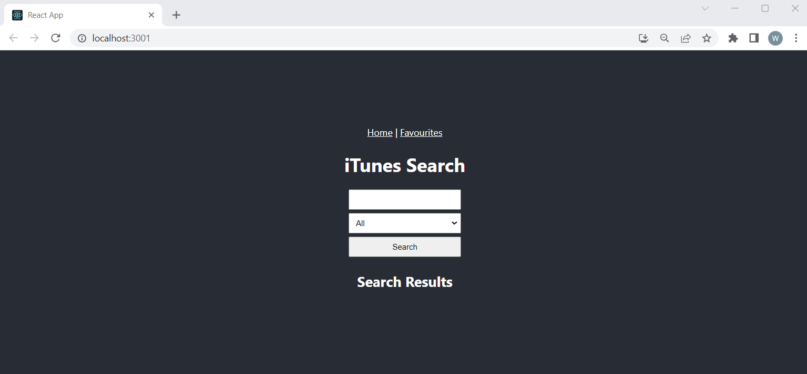
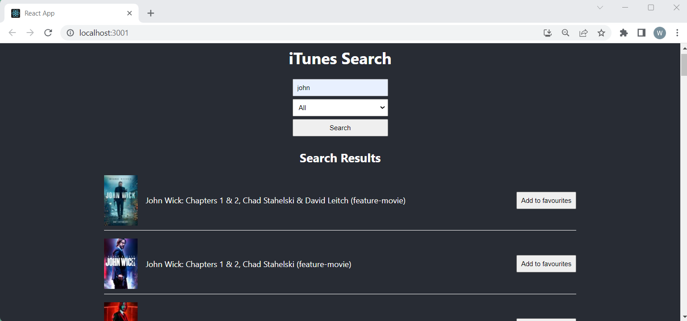
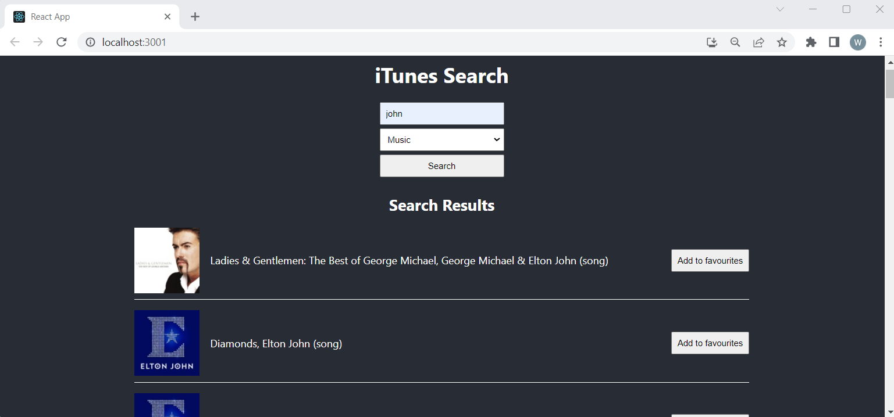
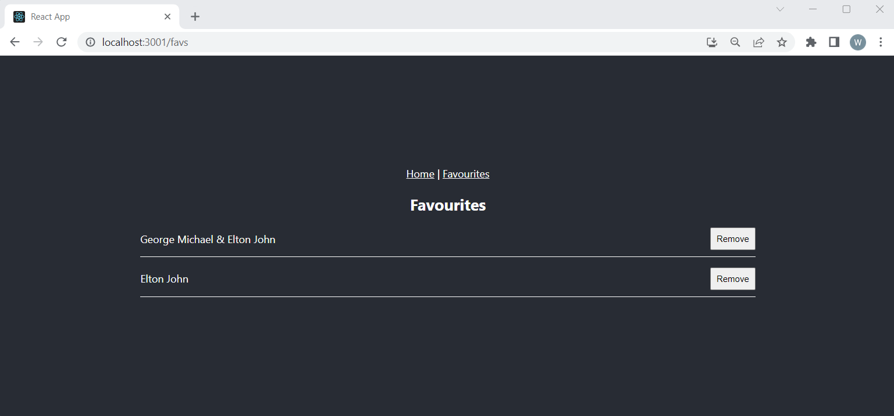

# iTunes Search

This is a full stack application with a client and a server. The client with connect to the server and pass query parameters to it, and the server will send a request to the iTunes search API to get search results, and give them back to the client and show them to the user.

# Installation

To use the app, clone the repository from github to your local environment using the `git clone https://github.com/fakornamwealth/itunes-search.git` command. Then navigate to the project directory with `cd itunes-search`.

From there you need to run the server app first with:
`cd server && npm run start`

Leave the server directory with `cd ..`.

Then you can start the client with:
`cd client && npm run start`

Now your server and client should be running. Open the client in your browser by navigating to `http://localhost:3001/`.

## How to use the app?

Once the server and client are running and you can access the client application on the browser, you can use the search bar to search for items on the iTunes store.

This items may be of different media types. Use the drop-down menu to specify a media type if you want a more specific search. Default media type will be "All" and it will include all media types.

After you search a term and get some results, you can press the Add to Favourites button next to the result row. This will add that specific result to the favourites section.

You can navigate between sections using the navigation menu at the top of the page. The Favourite link will take you to the favourites section and will show which items have been added to the favourites section.

You can also remove items from this section with the Remove button next ot each item.

You can also navigate back to the search page with the Home link in the menu.

## Testing

To test the app, navigate to the server directory and run `npx mocha`.

## Helmet security

In order to ensure the security of the server, this project uses Helmet.

Helmet helps secure Express apps by setting HTTP response headers.

The iTunes API does not require any API keys to consume.

Learn more about Helmet, including a comprehensive list of headers set by it, at https://helmetjs.github.io/

## Netlify Deploy

The front end has been deployed to Netlify, here:
https://delightful-dodol-a277fb.netlify.app/

It's not possible to deploy the backend part of this app to Netlify.

## Available Scripts

In the project directory, you can run:

### `npm start`

Runs the app in the development mode.\
Open [http://localhost:3000](http://localhost:3000) to view it in your browser.

The page will reload when you make changes.\
You may also see any lint errors in the console.

### `npm test`

Launches the test runner in the interactive watch mode.\
See the section about [running tests](https://facebook.github.io/create-react-app/docs/running-tests) for more information.

### `npm run build`

Builds the app for production to the `build` folder.\
It correctly bundles React in production mode and optimizes the build for the best performance.

The build is minified and the filenames include the hashes.\
Your app is ready to be deployed!

See the section about [deployment](https://facebook.github.io/create-react-app/docs/deployment) for more information.
